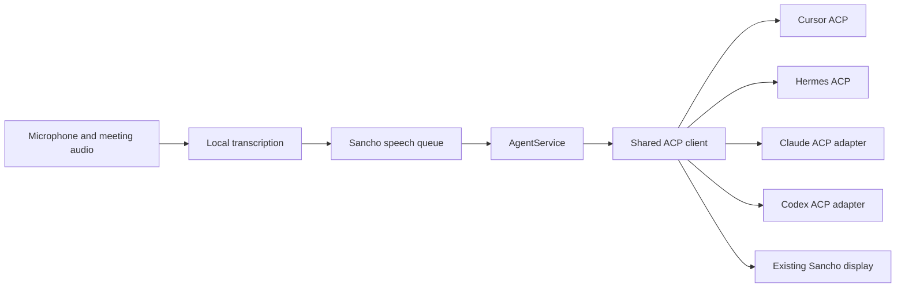

# ACP assessment for Sancho

Researched 2026-10-04 on branch `codex/acp-research`, based on master `e10deec`. This is a provisional assessment, not a migration decision. No production integration was changed.

## Recommendation

Add an opt-in ACP v1 transport behind the existing `AgentService` interface, starting with Cursor. Keep the current CLI integrations until each ACP backend passes the same acceptance checks. ACP fits the requirement to swap agents while retaining the voice experience, but it does not make all agent features or account rules identical.

Use one shared C# ACP client and small backend profiles for launching, authentication, instructions, permissions and optional extensions. Do not create four complete ACP clients. Do not switch the default transport until resume, tools, cancellation and permissions work on both Windows and Ubuntu.

## What actually changes

ACP here means **Agent Client Protocol**, the editor/client-to-coding-agent protocol. It is distinct from MCP (agent-to-tools) and similarly named agent communication protocols. Sancho would act as the client; the coding agent or its adapter would act as the server. Local ACP uses a spawned subprocess and bidirectional JSON-RPC messages. [ACP introduction](https://agentclientprotocol.com/get-started/introduction)

The current code already uses structured CLI interfaces, rather than simulated keystrokes or scraping the visible terminal:

| Backend | Current Sancho integration | ACP path |
|---|---|---|
| Claude | Persistent process; streaming JSON input/output | Claude Agent SDK ACP adapter |
| Codex | `exec --json`, then a resumed process for later turns | Codex ACP adapter, which drives app-server |
| Cursor | Print-mode streaming JSON; a process per turn | Native `agent acp` |
| Hermes | One-shot streaming JSON; a process per turn | Native `hermes acp` with ACP dependencies |

ACP would replace the backend communication layer. Microphone capture, device selection, Whisper/VAD, meeting transcription, speech queuing, notes and the terminal display remain Sancho responsibilities. Sending recognized text preserves local speech processing; changing the agent protocol does not improve recognition or correct input clipping.

## Verified support and limits

### Cursor

Cursor documents `agent acp`, newline-delimited JSON-RPC over stdio, authentication through existing CLI credentials, session creation/loading and streamed updates. Clients must answer permission requests. It also documents blocking `cursor/ask_question` and `cursor/create_plan` requests, plus optional notifications. Project/user MCP configuration is supported; dashboard team-level MCP configuration is excluded. These are concrete parity checks, not details to hide behind a generic ACP label. [Cursor ACP documentation](https://prod.cursor.com/docs/cli/acp)

I launched the installed Windows build `2026.10.01-e373342` through its bundled Node entry point and sent **only initialize**. It returned protocol version 1, `loadSession: true`, `sessionCapabilities.list`, image support, HTTP/SSE MCP support, and `audio: false` / `embeddedContext: false`. No model prompt, authentication flow or new session was sent. The owned process tree was stopped. The sanitized response is in [acp-cursor-initialize.json](acp-cursor-initialize.json).

This verifies protocol availability on this Windows machine, not tool execution, history replay, cancellation or Ubuntu support. Cursor is the best first experiment because it needs no extra ACP adapter and directly addresses an existing process-per-turn backend.

### Codex

The maintained package is `@agentclientprotocol/codex-acp`. It translates ACP to Codex app-server, supports ChatGPT/API-key authentication, configuration and agent events, and bundles a compatible Codex dependency. `CODEX_PATH` can select another binary, which then needs compatibility testing. The old `zed-industries/codex-acp` repository is archived and explicitly directs new installs to the replacement. [Maintained adapter](https://github.com/agentclientprotocol/codex-acp), [archived adapter notice](https://github.com/zed-industries/codex-acp)

The installed Codex CLI is `0.160.0`; its help exposes app-server and does not expose an ACP command. App-server itself has a different JSON-RPC dialect and lifecycle: initialization, threads and turns, with native session/history and approvals. OpenAI currently labels app-server experimental. Thus a direct app-server integration is a viable alternative, but it would preserve a Codex-specific adapter instead of achieving one ACP transport for all agents. [Official app-server documentation](https://developers.openai.com/codex/app-server/)

No Codex ACP package was installed or exercised during this research. Its advertised features remain documentation evidence, not local acceptance results.

### Claude

`@agentclientprotocol/claude-agent-acp` is a maintained ACP adapter over the Claude Agent SDK, not a built-in `claude acp` command. It exposes messages, tools and permissions, with additional negotiated features. The current main-branch package requires Node 22 or newer; a released version must be pinned and checked separately. [Adapter repository](https://github.com/agentclientprotocol/claude-agent-acp), [package manifest](https://raw.githubusercontent.com/agentclientprotocol/claude-agent-acp/main/package.json)

Anthropic's SDK overview says third-party developers may not offer claude.ai login or rate limits for their products without prior approval. Therefore we must establish the permitted authentication arrangement for Sancho before promising Claude subscription parity through this SDK adapter. An adapter accepting local credentials technically would not, by itself, establish permission to offer that flow. API-key authentication may be required, which changes billing expectations. This is an unresolved migration condition; it is not a claim that every existing local CLI use is prohibited. [Anthropic SDK authentication guidance](https://code.claude.com/docs/en/agent-sdk/overview)

Adapter source exposes provider-specific system-prompt metadata and permission configuration. That can preserve Sancho's appended instructions, but it requires a profile rather than a protocol-wide switch. Its source also distinguishes ordinary bypass mode from requests that still require interaction. [Claude adapter implementation](https://raw.githubusercontent.com/agentclientprotocol/claude-agent-acp/main/src/acp-agent.ts)

### Hermes

Hermes exposes `hermes acp`; its optional ACP dependencies must be installed. It uses the configured provider and credentials rather than a separate ACP account. ACP sessions use the shared Hermes session database and can be restored across process restarts. Its asynchronous protocol bridge drives the same synchronous agent core and bridges approvals/cancellation. Documentation notes that non-text prompt extraction is limited. [Hermes integration overview](https://hermes-agent.nousresearch.com/docs/developer-guide/programmatic-integration/), [ACP internals](https://hermes-agent.nousresearch.com/docs/developer-guide/acp-internals/)

Hermes ACP uses a curated editor-oriented toolset; messaging delivery and cron management are excluded by default. Configured toolsets/MCPs can change it. Consequently CLI and ACP behavior can differ even with the same provider/model. [Hermes ACP host integration](https://hermes-agent.nousresearch.com/docs/user-guide/features/acp/)

Hermes was not reinstalled for this research, respecting the requested local cleanup. Future live testing should use an isolated temporary environment and remove it afterward.

## Benefits for Sancho

| Benefit | Practical value | Qualification |
|---|---|---|
| Shared message contract | One text/tool/turn parser across agents; fewer provider-specific JSON fixes | Launch and optional-feature profiles remain |
| Persistent agent sessions | Avoid repeated process startup on Codex/Cursor/Hermes turns | Lower latency is a hypothesis until measured; Claude already persists |
| Explicit turn completion | Complete a turn from the correlated prompt response and its stop reason | Partial output, cancellation and failures still need careful handling |
| Graceful interruption | Ask an agent to cancel a turn without always destroying the process | Keep a bounded timeout and process-tree termination fallback |
| Session APIs | Reduce scraping session files and opaque Cursor history handling | Listing/loading are capability-dependent and must be tested |
| Richer progress | Shared tool activity, plans and optional configuration/usage updates | The display must decide what to show |
| More future backends | ACP servers can reuse the transport rather than require a new parser | This does not validate their models, tools or authentication |

ACP defines streamed `session/update` events, tool activity and a final `session/prompt` response with a stop reason. The existing `Ready`/`TurnStart`/`TurnComplete` flow can be mapped onto those events. Cancellation must keep consuming updates until the prompt terminates; an acknowledged cancellation is different from killing the entire agent. [Prompt-turn lifecycle](https://agentclientprotocol.com/protocol/v1/prompt-turn), [request cancellation](https://agentclientprotocol.com/protocol/v1/cancellation)

## Costs and pitfalls

**A protocol client is more complicated than a line parser.** Requests, responses, notifications and agent-initiated requests share the wire. We must correlate IDs, serialize writes, keep reading while a prompt is pending, bound pending work and fail it on disconnect. Waiting for a prompt response on the same loop that must answer a permission request will deadlock.

**ACP still uses standard input/output locally.** UTF-8 newline framing is strict; stdout contains protocol messages and stderr contains diagnostics. Windows launch discovery, quoting, executable wrappers and process ownership remain necessary. ACP removes format diversity, not operating-system behavior. Remote HTTP transport is still a draft in the v1 transport documentation; it should not be part of the first migration. [ACP transports](https://agentclientprotocol.com/protocol/v1/transports)

**Feature parity is negotiated.** A baseline prompt connection does not guarantee list/load/resume/fork, images, audio or MCP transport variants. A missing capability means unsupported. Keep local transcription and send text to every backend; do not rely on ACP audio to unify voice input. [Initialization and capabilities](https://agentclientprotocol.com/protocol/v1/initialization)

**YOLO is a Sancho policy, not one universal ACP setting.** Configure a backend's advertised full-access mode where supported, and map permitted tool requests using the offered option kinds/IDs. Tool approval is separate from answering a user question or choosing a plan. Those questions need UI/voice handling or an explicit unsupported response; they must not silently become tool approvals. ACP reports tool calls and permission choices but does not erase each provider's policies. [Tool calls and permissions](https://agentclientprotocol.com/protocol/v1/tool-calls), [structured elicitation](https://agentclientprotocol.com/protocol/v1/elicitation)

**System instructions remain different.** Standard session setup establishes workspace/MCP context; it does not provide a universal replacement for the existing Claude system-prompt append and Codex developer-instruction mapping. Preserve `.sancho.md` through backend configuration/extensions where available. Prepending it as ordinary text is possible but has different precedence and must not be described as equivalent.

**History and session ownership can change.** `session/load` replays history, while optional `session/resume` restores context without replay. ACP IDs belong to an implementation; they do not transfer memory between Claude, Codex, Cursor and Hermes. Native CLI-created sessions may or may not be discoverable/resumable through an adapter. The current synchronous `ListSessions`/`GetSessionMessages` interface will need an asynchronous path or an explicitly populated cache. Replay must not look like a fresh assistant turn. [Session setup](https://agentclientprotocol.com/protocol/v1/session-setup), [session listing](https://agentclientprotocol.com/protocol/v1/session-list)

**Resource and deployment tradeoffs need measurement.** Persistent agents can reduce startup work while retaining memory during idle periods. Claude/Codex adapters add runtime/dependency layers; the Codex adapter may use a bundled CLI that differs from the user's installed one. No RAM, latency or cost improvement has been measured here. The protocol does not change inference prices or account entitlements.

**The standard is evolving.** v1 is the initial target. v2 is explicitly draft and changes lifecycle, capabilities and other surfaces; implementation should isolate version-specific DTOs. Session configuration is preferred over the older modes API when advertised. Agent-specific extensions also remain relevant. [v2 proposal](https://agentclientprotocol.com/rfds/v2/overview), [session configuration](https://agentclientprotocol.com/protocol/v1/session-config-options), [extensibility](https://agentclientprotocol.com/protocol/v1/extensibility)

## C# implementation choices

The ACP documentation lists .NET libraries as community maintained. Candidates are `acp-csharp`, `Acp.Net` and `Agentic.ACPLibrary`; none should be assumed to be an official .NET SDK. [Community libraries](https://agentclientprotocol.com/libraries/community)

| Choice | Assessment |
|---|---|
| `acp-csharp` | Client/agent SDK candidate; evaluate current schema coverage, extension dispatch, cancellation and publishing compatibility. [Repository](https://github.com/nuskey8/acp-csharp) |
| `Agentic.ACPLibrary` | Client/agent library with handler interfaces and a mock agent; useful comparison for protocol/transport boundaries. [Repository](https://github.com/AgenticDesktop/ACPLibrary) |
| `Acp.Net` | Its authors explicitly describe it as a process/testing toolkit, not a complete protocol SDK. It cannot alone replace our wire client. [Repository](https://github.com/MertBasar0/acp-net) |
| Small native C# client | Fits the limited first experiment and existing process ownership, but we own correctness, schema updates and tests |
| TypeScript sidecar | Access to an official language SDK, but adds another runtime/process layer to Sancho itself |

My provisional preference is a small native C# client or a validated C# library, with protocol code isolated from the voice orchestrator. Audit serializer/source-generation and NativeAOT/trimming behavior against our release settings before choosing. This research did not compile or benchmark those libraries and does not establish their production readiness.

## Proposed implementation and acceptance gates

1. Add an explicit transport option, initially CLI by default. Add one ACP client, backend launch profiles and capability reporting. Implement protocol v1 with filesystem/terminal client capabilities disabled initially; verify agents retain working native file/shell tools before enabling a backend.
2. Map ACP to the existing `AgentEvent` contract. Preserve synchronous turn reservation and the speech queue. Keep one prompt in flight; do not assume universal steering support. Continue reading server requests and updates while awaiting responses. Distinguish replay, fresh text, errors and stop reasons.
3. Implement Cursor first: same installed account, two-turn recall, file writing, workspace identity, native-session discovery/history and clean cancel/restart on Windows and Ubuntu. Handle its documented blocking extension requests. Keep the old Cursor transport available.
4. Add Codex using the maintained pinned ACP adapter; compare its bundled versus installed CLI behavior. Add Hermes in an isolated installation. Add Claude after resolving the SDK authentication arrangement and confirming instructions/tool parity.
5. Only make ACP the default per backend after live and deterministic parity checks pass. Preserve an explicit CLI option during rollout. Do not silently replay a possibly executed prompt through another transport after a timeout: that could execute the same action twice.

Extend `Sancho.ProcessTestHost` with a fake ACP server. Deterministic tests should cover initialization/version mismatch; capabilities omitted; Unicode/newline framing; interleaved notifications and responses; permission/elicitation requests during a pending prompt; unknown optional updates; disconnect/malformed stdout; duplicate turn admission; all stop reasons; replay without duplicate replies; cancellation before/during tools; stderr flooding; restart and descendant cleanup. Run them on both platforms.

Keep the stored audio regression unchanged. Add a fixture-to-transcription-to-ACP-fake test to verify recognized speech reaches the normal display once, in order. Live model calls should separately test native file operations, second-turn recall, restart/resume, `.sancho.md`, MCP configuration and YOLO behavior for each backend. Measure cold start, warm first-text latency, idle RAM and shutdown with repeated comparable runs; no performance promise before that evidence.

The ACP project provides an experimental agent Test Compatibility Kit. It can help evaluate provider implementations, but passing it is not full conformance and it does not replace tests of Sancho as a client. [ACP testing guidance](https://agentclientprotocol.com/libraries/testing)

## Decision still open

The strongest reason to adopt ACP is reduced integration maintenance and a more consistent conversation lifecycle. The strongest reason to retain a hybrid is preserving working account/tool/session behavior where an ACP adapter differs. Research supports a staged Cursor experiment, not an immediate replacement of all four backends.

Evidence boundary: current primary documentation and selected source files were inspected; the installed Cursor capability handshake was exercised; Codex app-server availability was inspected. No paid ACP turn, Ubuntu ACP run, Claude/Codex adapter install, Hermes reinstall, performance benchmark or production code migration was performed.
